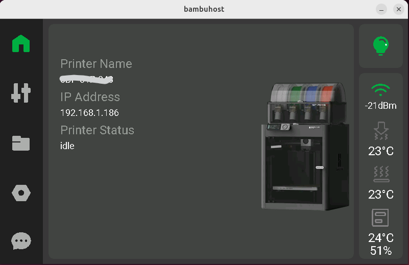

# ESPHome Bambu Panel

## Introduction

This is a work in progress ESPHome project to display Bambu Printer information on a Waveshare 7" or 4.3" display. It is provided as is without any support and minimal instructions as still in slow development. It is reliant on Greg Hesps Home Assistant integration and has all the limitations that that has. [See here](https://github.com/greghesp/ha-bambulab) . This is not a beginners project and knowledge of ESPHome and LVGL is needed.



## Installation

Copy the 'BambuPanelResources' folder to your ESPHome folder. The 'bambupanel.yaml' file is the base build file and is used to create the ESPHome bin file for the Waveshare screen, there is minimal content in here and is purely used for hardware specific things. The project was built for the 7" display but the 4.3" settings are included but commented out. I advise you add OTA and API passwords.

I do a lot of the development in SDL2 Host and 'bambuhost.yaml' can be used to build a SDL2 host.

The main LVGL content is the 'common.yaml' and there is a required change needed in here within the substitutions section at the start, change PrinterEntity to match the Entity name of your printer in Home Assistant.

`PrinterEntity: "p1s\_changeme"`
There are various other substituitions here that can be changed for language and user preferences.

Create a folder in Home Assistant as follows, this will be used to store a snapshot of your cover image.

`/config/www/media/bambuprinter`

Modifiy your Home Assistant configuration.yaml and add the following

```
homeassistant:
  allowlist_external_dirs:
    - "/config/www/media/bambuprinter"
```
Restart Home Assistant

Build your ESPHome project and add to Home Assistant. You need to allow the ESPHome device to carry out Home Assistant actions navigate to

`Settings > Devices & services > ESPHome`

Find your device and click the settings cog and check 'Allow the device to perform home assistant actions'

## Cover Image Update automation

Once the print starts it is necessary to copy the cover image to your home assistant web directory in the folder above, this is done by an automation approximately 30 seconds after the print starts. For an example automation see the file 'automation.yaml' or as below

```
alias: 3DPrinterCoverImage
description: ""
triggers:
  - device_id: changeme
    domain: bambu_lab
    type: event_print_started
    trigger: device
conditions: []
actions:
  - delay:
      hours: 0
      minutes: 0
      seconds: 30
      milliseconds: 0
  - action: image.snapshot
    metadata: {}
    data:
      filename: /config/www/media/bambuprinter/cover.png
    target:
      entity_id: image.p1s_changeme_cover_image
  - delay:
      hours: 0
      minutes: 0
      seconds: 10
      milliseconds: 0
  - action: button.press
    metadata: {}
    data: {}
    target:
      entity_id: button.bambupanel_imageupdate_2
mode: single
```

## Progress

Most of the sensors work, the light can be turned on/off, the status home screen works. Some of the temperature and fan controls work, but only show whilst printing.


